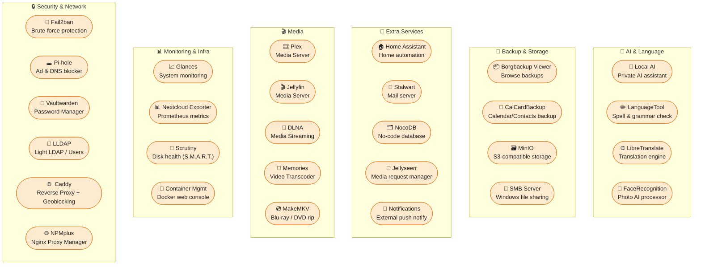

# Community containers
This directory features containers that are built for AIO which allows to add additional functionality very easily.

## Disclaimers
All containers that are in this directory are community maintained so the responsibility is on the community to keep them updated and secure. There is no guarantee that this will be the case in the future.

## Overview

## How to use this?
Starting with v11 of AIO, the management of Community Containers is done via the AIO interface (it is the last section in the AIO interface, so only visible if you scroll down). 

⚠️⚠️⚠️ Please review the folder for documentation on each of the containers before adding them! Not reviewing the documentation for each of them first might break starting the AIO containers because some containers are not compatible with each other and more.

## How to add containers?
Simply submit a PR by creating a new folder in this directory: https://github.com/nextcloud/all-in-one/tree/main/community-containers with the name of your container. It must include a json file with the same name and with correct syntax and a readme.md with additional information. You might get inspired by caddy, fail2ban, local-ai, libretranslate, plex, pi-hole or vaultwarden (subfolders in this directory). For a full-blown example of the json file, see https://github.com/nextcloud/all-in-one/blob/main/php/containers.json. The json-schema that it validates against can be found here: https://github.com/nextcloud/all-in-one/blob/main/php/containers-schema.json.

### Is there a list of ideas for new community containers?
Yes, see [this list](https://github.com/nextcloud/all-in-one/issues/5251) for already existing ideas for new community containers. Feel free to pick one up and add it to this folder by following the instructions above.

## How to remove containers from AIOs stack?
You can remove containers now via the web interface.

After removing the containers, there might be some data left on your server that you might want to remove. You can get rid of the data by first running `sudo docker rm nextcloud-aio-container1`, (adjust `container1` accordingly) per community-container that you removed. Then run `sudo docker image prune -a` in order to remove all images that are not used anymore. As last step you can get rid of persistent data of these containers that is stored in volumes. You can check if there is some by running `sudo docker volume ls` and look for any volume that matches the ones that you removed. If so, you can remove them with `sudo docker volume rm nextcloud_aio_volume-id` (of course you need to adjust the `volume-id`). **Please note:** If you do not have CLI access to the server, you can now run docker commands via a web session by using this community container: https://github.com/nextcloud/all-in-one/tree/main/community-containers/container-management
